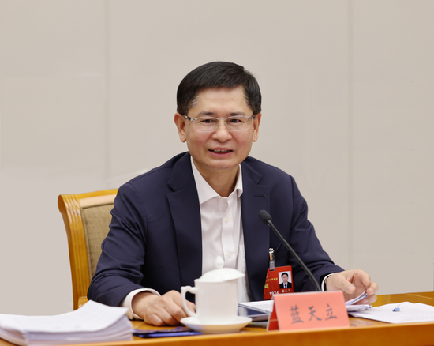

+++
date = '2025-07-16T09:43:25+08:00'
draft = false
title = '山林不能给野火，江海不能灌漏卮'
+++
### 蓝天立事件（截至2025年7月）

“蓝天立事件”指的是广西壮族自治区党委副书记、自治区政府主席蓝天立于 2025 年 5 月被中央纪委国家监委立案查处的重大政治事件。

---

#### 🧭 事件概述

- **立案时间**：2025年5月16日  
- **调查机构**：中央纪委国家监委  
- **通报内容**：涉嫌严重违纪违法，正在接受纪律审查和监察调查  
- **地方响应**：广西自治区党委召开紧急常委扩大会，全区开展配套清理与整顿  

来源：[Wikipedia - 蓝天立](https://zh.wikipedia.org/zh-hans/%E8%93%9D%E5%A4%A9%E7%AB%8B)

---

#### 🏛️ 后续处置进展

| 日期         | 措施                             | 详情                                                                 |
|--------------|----------------------------------|----------------------------------------------------------------------|
| 2025/05/16   | 官宣立案                         | 中央纪委国家监委网站通报                                            |
| 2025/05/29   | 自治区人大接受其辞职             | 同时罢免其自治区人大代表、全国人大代表职务                          |
| 2025/06      | 全国人大常委会终止其代表资格     | 按程序确认，完全解除公职身份                                        |

源：[财新网](https://china.caixin.com/2025-05-29/102325427.html)

---

#### 👥 牵涉人员

- **韦霄燕**：蓝天立妻子，广西医科大学统战部原部长，传被同步调查  
- **蓝某弟**：蓝天立胞弟，涉及资产问题  
- **陈刚**：广西自治区党委书记，表态“确保政治生态稳定”  

源：[新浪财经](https://finance.sina.com.cn/roll/2025-05-21/doc-inexicec6082448.shtml)

---

#### 🌍 关联背景与整顿行动

- **环境治理倒查十年**：启动针对非法采矿与重金属污染的倒查机制  
- **可能涉及金属矿权贪腐链条**  
- **广西政坛动荡**：与2025年同时被查的金湘军仕途有交集  

源：[中央社](https://www.cna.com.tw/news/acn/202505210171.aspx) [南方都市报](https://m.mp.oeeee.com/a/BAAFRD0000202505161086977.html)

---

#### 🧾 蓝天立简历回顾

- 出生：1962年，广西河池人，壮族  
- 学历：广西大学工程硕士  
- 曾任：广西科技厅厅长、河池市委书记、自治区副主席、政协主席  
- 主席任期：2020年10月起主持政府，2021年1月正式当选自治区主席  

源：[新民晚报](https://shanghai.xinmin.cn/xmsq/2020/10/19/31827891.html)

---

#### ⚖️ 事件分析与意义

1. **高压反腐常态化**：蓝天立是中共二十大后第二位“任上落马”的省级“一把手”  
2. **生态环保进入反腐主线**：以“重金属污染”为抓手倒查产业腐败  
3. **地方治理架构整肃**：广西高层人事或将重组，震慑效应显著  

