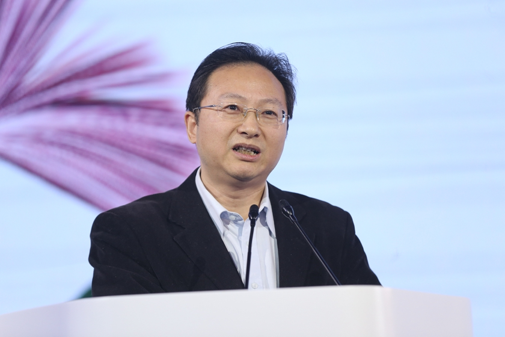

+++
date = '2025-07-16T09:54:01+08:00'
draft = false
title = 'Yaoqian'
+++

### 姚前事件：数字人民币研发者涉加密货币腐败案（Markdown版整理）

> 截至 2025 年 7 月，中国金融科技领域前高官 **姚前** 因涉嫌严重违纪违法被“双开”，案件涉及“虚拟货币行贿受贿”，是中国首次在官方反腐通报中提及 **加密货币权钱交易**。

---

#### 1. 姚前简介与履历

- **姓名**：姚前  
- **学历背景**：南京大学 信息管理与计算机 博士  
- **关键职位**：
  - 2017 年起担任中国人民银行数字货币研究所首任所长  
  - 2019 年后调任证监会，历任科技监管局局长、信息中心主任等

> 被称为中国法定数字货币（e-CNY）研发的“总设计师”

---

#### 2. 调查与处分时间线

| 日期           | 节点        | 机构                                   | 描述摘要                                     |
|----------------|-------------|----------------------------------------|----------------------------------------------|
| 2024-04-26     | 立案审查    | 中央纪委驻证监会纪检组、广东省纪委    | 涉嫌严重违纪违法                             |
| 2024-11-20     | “双开”通报 | 中央纪委国家监委                      | 收受巨额财物，利用虚拟货币进行权钱交易       |
| 2024-11-21     | 媒体曝光    | SCMP, Global Times 等                  | 被称为中国首例“虚拟货币腐败案”               |
| （未公开）     | 司法移送    | 汕尾市监察机关                         | 涉及受贿、洗钱等指控                         |

---

#### 3. 加密货币涉案细节

- 官方明确表述：“**利用虚拟货币进行权钱交易**”
- 媒体引述称：**“受贿主要通过比特币收取”**
- 利用加密货币 **去中心化、难追踪** 特性转移资产

> **注意**：官方通报中并未明确币种为“比特币”，媒体报道多为引述消息人士

---

#### 4. 数字人民币项目受影响情况

- **项目未中断**：现任所长穆长春领导团队，e-CNY 持续扩展试点城市
- **政策加强**：央行与证监会加码“技术岗位反腐”与“虚拟资产监管”
- **合规信号**：
  - 国家支持“**可控匿名、可监管**”的法定数字货币
  - 打压“去中心化、匿名逃避监管”的加密资产（如 BTC/ETH）

---

#### 5. 流言与事实澄清表

| 传言内容                           | 真实情况                                     | 来源说明                         |
|------------------------------------|----------------------------------------------|----------------------------------|
| 数字人民币“总负责人”被抓           | 姚前早在 2018 年离开央行，非现负责人         | 人民银行官网、通报内容           |
| “涉嫌比特币洗钱 40 亿”             | 官方未公布具体金额和币种                     | 通报中仅表述“金额特别巨大”       |
| 所有受贿款均为加密币               | 未被证实，可能为部分贿款以 BTC 支付         | 媒体推测与报道，不具权威性       |

---

#### 6. 事件意义分析

-  **首次写入纪委通报的“虚拟货币腐败”案例**  
-  暴露监管科技岗位“旋转门”问题与贪腐风险  
-  为数字金融、区块链行业合规划出红线  
-  强化金融科技人事与资金流的多维审计

---

#### 参考资料与延伸阅读

- [中央纪委国家监委官网 - 姚前被“双开”通报](https://www.ccdi.gov.cn)
- [人民日报：姚前案反映的技术监管腐败新动向](https://www.people.com.cn)
- [南方都市报：姚前涉案细节曝光，虚拟币行贿受贿](https://www.southcn.com)
- [SCMP: China official who helped develop digital yuan sacked for crypto bribery](https://www.scmp.com)
- [链闻：姚前受贿细节首次曝光，警惕加密腐败穿透监管](https://www.chainnews.com)
- [穆长春：数字人民币“可控匿名”与监管透明性演讲稿](https://www.pbc.gov.cn)

---

